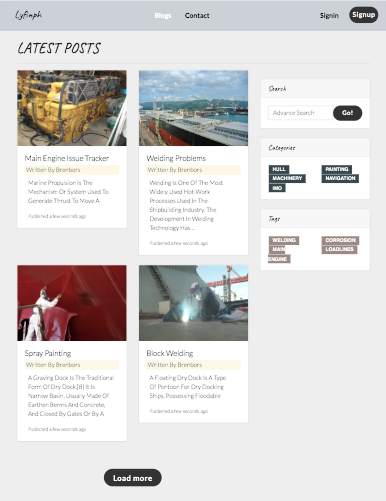
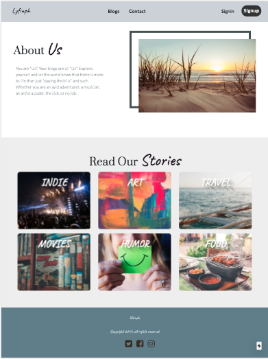

### MULTI-USER Blogging Platform with SEO

Add next.config.js file variables:

```js
const withCSS = require("@zeit/next-css");

module.exports = withCSS({
  publicRuntimeConfig: {
    APP_NAME: "",
    API_DEVELOPMENT: "",
    API_PRODUCTION: "",
    PRODUCTION: false,
    DOMAIN_DEVELOPMENT: "",
    DOMAIN_PRODUCTION: "",
    FB_APP_ID: "",
    DISQUS_SHORTNAME: "",
    GOOGLE_CLIENT_ID: ""
  }
});
```

To run on terminal

```js
npm run dev
```

## App Screenshots




Front-end:

- React / Next.js

1st commit:

- Completed Next.js project set-up
- Added Navbar with links

2nd commit :

- Completed front-end signin/signout with authentication actions

3rd commit:

- Added NProgress loading feature on Header.js component
- Added NProgress CDN on \_document.js

4th commit:

- Added CRUD Categories and Tag components and functionality

5th commit:

- Added CRUD Blogs front-end UI and func
- Added Related Blogs front-end and func
- SEO to Blogs and singleBlog pages

6th commit:

- Improve UI on signin/signout components
- Completed Update/Delete on front-end func
- Added simple footer

7th commit:

- Added Search blogs functionality
- Change back signin/signout UI
- Completed Tags and Categories slug.js

8th commit:

- Added User Public profile UI
- Creating blogs by authenticated user UI

9th commit:

- Added DisqusThread comment system
- Added Token expiry to local storage

10th commit:

- Added react-share social media blog sharing

11th commit:

- added forgot password actions and pages

12th commit:

- added account activation on sign-up pages
- added Google sign-in UI
- added Google analytics set-up
- Improved index.js landing page UI

13th commit:

- deleted search.js file
- improved UI on all pages. change colors

14th commit and beyond...

- update user profile added social media inputs for user
- Social media links on user profile page
- active links on navbar
- improved blog > slug.js (single blog page) design

To-Do list Bugs:

Not working:

- like/unlike functionality

- On ProfileUpdate.js, whenever the Username is changed, the photo goes to error or disappears
- On profile [username].js, if user has no profile, the page just keeps on loading. But when stop on browser, the default image is shown
- On Categories & Tags [slug].js, username profile is undefined
